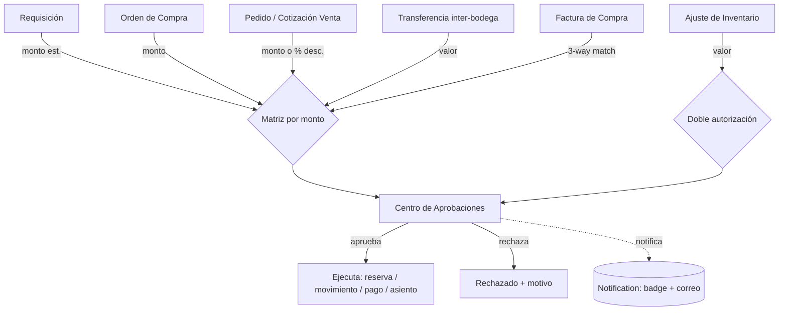

# 16 — PLAN MAESTRO DE MEJORAS Y EVOLUCIÓN A ERP CORPORATIVO (V3 — Reconciliado)

> **Fecha:** 2026-06-20
> **Naturaleza:** Fusión de la propuesta de análisis inicial (V1) + la propuesta de evolución corporativa (V2),
> **reconciliada contra el código real** del proyecto (lectura directa de `schema.prisma` y servicios).
> **Objetivo:** Llevar KallpaPro de un ERP funcional a uno corporativo, corrigiendo brechas de negocio
> (Ventas, Finanzas, Compras, Inventario), seguridad y reportería — **sin rehacer lo que ya existe**.

---

## 0. CÓMO EJECUTAR ESTE PLAN (Para Claude Code)

> ⚠️ **CORRECCIÓN DE STACK (crítica).** La propuesta V2 asumía **NestJS**. El backend real es **Express**.
> Toda referencia a NestJS/DTO/`@nestjs/schedule` queda **anulada** y se traduce al stack real:

| V2 decía (incorrecto) | Realidad del proyecto |
|---|---|
| NestJS · `Module > Service > Controller > DTO` | **Express** · `routes/ → controllers/ → services/` · validación con **Zod** (`schemas/`) |
| `@nestjs/schedule` para cron | **`node-cron`** (ya instalado) y **`bullmq`** (colas, ya instalado) |
| `useQuery`/`useMutation` (React Query) | El frontend usa **Axios + hooks propios + Zustand** (verificar antes de asumir React Query) |

**Reglas de ejecución:**
1. **Trabaja por Sprints en orden** (S1 → S6). No mezcles sprints.
2. **Prisma / Windows:** En este PC `prisma generate` falla con **EPERM** si hay procesos node del backend vivos o por OneDrive. **Mata los procesos node del backend antes de regenerar.** Para migrar: `npx prisma migrate dev --name <nombre>`. *Confirma con el usuario antes de correr migraciones* (las corre él en su entorno).
3. **Backend:** patrón existente `routes → controller → service`, Prisma como ORM, Zod para validar.
4. **Frontend:** actualizar tipos TS y la capa `api/` + hooks.
5. **Regla de oro:** **toda regla de negocio nueva es un valor en `ErpConfig`** (`erp-config.service.ts`), nunca un número quemado.
6. **Testing por sprint:** `npx tsc --noEmit` (back y front) + flujo feliz en navegador (`admin@gmail.com` / `12345678`).

---

## 0.1. CHEQUEO DE REALIDAD — Lo que YA EXISTE (NO recrear)

> Verificado en `schema.prisma` (75+ modelos). La V2 proponía crear varias cosas que **ya están**.

| Propuesta V2 | Estado real | Acción correcta |
|---|---|---|
| Multi-bodega `Warehouse` (S1.2) | ✅ **Completo**: `Warehouse` (jerárquico) + `StorageLocation` (zona/percha) + `ProductStock` con `@@unique([productId,warehouseId])` | **Nada que crear.** Usar lo existente |
| `AuditLog` (S1.3) | ⚠️ **Tabla existe** (no cableada — nadie escribe en ella) | Solo **cablear** middleware/helper de escritura |
| `DispatchGuide` (S1.4) | ✅ Existe `Shipment` + `ShipmentEvent` (carrier, tracking, estados PENDING→DELIVERED, ligado SALES/PURCHASE) | **No crear tabla nueva.** Enganchar `Shipment` en el despacho |
| `InventoryBatch` / FEFO (S5.1) | ✅ Existe con `lotNumber`, `expiryDate`, `daysLife`, `remainingQty` | Solo implementar **lógica FEFO** en reservas |
| `InventoryTransfer` (S4.2) | ⚠️ `InventoryMovement` ya soporta `TRANSFER_IN/OUT` + bodega origen/destino; hay `WarehouseTransferPage` | Falta el **documento formal con aprobación**, no el movimiento |
| `WithholdingTax` (S2.3) | ⚠️ Existe `SriRetention` + `RetentionCatalog` (lado SRI/compras) | **Extender** a retenciones de venta, no duplicar |
| `SupplierScore` (S4.4) | ✅ Existe + `SupplierPerformanceRecord` (`supplier-scoring.service.ts`) | Solo afinar el cálculo automático |
| `PhysicalCount` (conteo cíclico) | ✅ Existe `PhysicalCount` + `PhysicalCountItem` + `PhysicalCountPage` | Falta solo **programación** de conteos |
| Matriz de aprobación | ✅ `ApprovalMatrix` + `getRequiredLevels` (cableada en OC) | **Reutilizar** en ventas/requisición |

**Modelos genuinamente NUEVOS a crear** (no existen): `DocumentSequence`, `Payment`, `PaymentApplication`,
`PriceList`, `PriceListItem`, `UserSession`, `LoginAttempt`, `ExchangeRate`, `PurchaseReceipt` + `PurchaseReceiptItem`,
`CustomerAdvance`, `Notification`. Campos nuevos en `User` (2FA), en `Customer`/`Supplier` (moneda).

---

## 1. DIAGNÓSTICO TRANSVERSAL

### 1.1. 🔴 Numeración de documentos NO atómica `[P0]`
**Archivos:** `sales.service.ts:49/138/370`, `inventory-adjustment.service.ts:44`, y demás correlativos (`REQ-`, `OC-`).
**Problema:** se genera leyendo el "último" con `findFirst orderBy createdAt` o `count()` → dos requests simultáneos generan el **mismo número** (duplicado/colisión de índice). Invisible en demo, real en producción.
**Solución:** tabla `DocumentSequence (companyId, docType, prefix, padding, lastNumber)` + helper `nextDocNumber(tx, companyId, docType)` que incrementa **dentro de la misma transacción**. Centraliza también los prefijos de `ErpConfig.documents`.

### 1.2. 🔴 Auditoría de datos maestros sin cablear `[P0]`
**Estado:** la tabla `AuditLog` **existe** pero nadie escribe en ella.
**Problema:** cambiar precio de un producto, límite de crédito de un cliente o datos de un proveedor no deja rastro.
**Solución:** Prisma Client Extension (`$extends` query) o helper `audit(tx, {action, entityType, entityId, changes, userId, ip})` invocado en los `update`/`delete` de `Product`, `Customer`, `Supplier` (y luego precios, crédito, config).

### 1.3. 🔴 Sin Centro de Aprobaciones unificado `[P1]`
Aprobaciones dispersas: OC (matriz multinivel), ajustes (doble autorización), ventas (ninguna). No hay bandeja única "lo que me toca firmar". → §9.

### 1.4. 🔴 Sin notificaciones `[P1]`
Lo que queda PENDING no avisa a nadie. **Solución:** tabla `Notification` + badge en header + conteo en Inicio + (opcional) correo vía job.

---

## 2. MÓDULO DE VENTAS (Sales)

### 2.1. 🟢 Ya funciona
Cotización → pedido → confirmar (reserva stock) → despachar (consume + factura + asientos venta/COGS). `sales.service.ts`.

### 2.2. 🔴 Brechas confirmadas
1. **Límite de crédito NUNCA se valida** — `Customer.creditLimit` se guarda (`:36`) pero ni `createSalesOrder` ni `confirmOrder` lo consultan.
2. **Cotizaciones sin expiración** — `validUntil` se guarda; nada marca `EXPIRED`.
3. **Sin control de margen ni descuento** — no se alerta venta bajo `avgCost`; sin tope de descuento por rol.
4. **Sin aprobación de venta** de alto monto/descuento (la matriz existe pero no se usa aquí).
5. **`dispatchOrder` factura de inmediato** y **no crea `Shipment`** — debería generar guía y facturar al `DELIVERED`.
6. **No hay PDF** de cotización/pedido/factura de venta.

### 2.3. 🟡 Mejoras (fusión V1+V2)
| # | Mejora | Origen | Esf. |
|---|--------|--------|------|
| V1 | Validar crédito en `confirmOrder` (`cartera + pedido > creditLimit` → bloquea o exige aprobación). Config `sales.enforceCreditLimit` | V1 | M |
| V2 | Expiración automática de cotizaciones (`node-cron`) + bloquear conversión vencida | V1+V2 | S |
| V3 | Alerta/bloqueo venta bajo costo + tope de descuento por rol (`sales.maxDiscountByRole`) | V1 | M |
| V4 | Aprobación de venta por monto/descuento reutilizando `getRequiredLevels` | V1+V2 | M |
| V5 | **Guía de remisión vía `Shipment`**: al despachar se crea `Shipment` (consume stock de la bodega), y la **factura se emite cuando `Shipment.status = DELIVERED`** | V2 | M |
| V6 | **Anticipos de cliente** (`CustomerAdvance`): señal antes del despacho; se aplica a la factura | V2 | M |
| V7 | PDF de cotización/pedido/factura con branding | V1 | S |
| V8 | Versionado de cotización (rev. 1,2,3) para histórico de negociación | V1 | M |
| V9 | "Cotización abandonada": job avisa al vendedor si > 7 días sin convertir | V2 | S |
| V10 | Facturación recurrente (`isRecurring`, `billingPeriod`) para suscripciones | V2 | M |

---

## 3. MÓDULO DE COMPRAS (Purchases)

### 3.1. 🟢 Ya funciona
Requisición → cotizaciones (mínimo configurable, `requisition.service.ts:267`) → OC → **matriz de aprobación por monto** (`getRequiredLevels`). `SupplierScore`/`SupplierPerformanceRecord` existen.

### 3.2. 🔴 Brechas
1. **Requisición sin aprobación propia** (solo se aprueba la OC).
2. **Sin recepción física formal** (3-way match). No hay modelo `PurchaseReceipt`.
3. **Comparativo sin recomendación objetiva** (precio + score + plazo) ni justificación si no se elige al más barato.

### 3.3. 🟡 Mejoras (fusión)
| # | Mejora | Origen | Esf. |
|---|--------|--------|------|
| C1 | Aprobación de requisición por matriz antes de cotizar (`purchases.requisitionApprovalThreshold`) | V1 | M |
| C2 | **`PurchaseReceipt` + `PurchaseReceiptItem`** (`expectedQty`/`receivedQty`/`rejectedQty`), recepción a la bodega | V2 | M |
| C3 | **3-Way Matching**: factura de compra solo "aprobada para pago" si `facturado ≤ recibido + tolerancia` (`purchases.invoiceTolerance`) | V2 | M |
| C4 | Comparativo con columna "Recomendado" (precio+score+plazo) + justificación obligatoria si no es el más barato | V1 | M |
| C5 | PDF del cuadro de adjudicación | V1 | S |
| C6 | Scoring automático de proveedor por cumplimiento de plazos (entrega real vs prometida) | V1+V2 | M |

---

## 4. MÓDULO DE INVENTARIO / LOGÍSTICA

### 4.1. 🟢 Ya funciona
Multi-bodega completo, kardex (`InventoryMovement`), costo promedio/FIFO, `InventoryBatch` (lotes+vencimiento), ajustes con doble autorización, `PhysicalCount`, transferencias vía movimientos, `Shipment`/`ShipmentEvent` (tracking).

### 4.2. 🔴 Brechas
1. **Ajustes sin evidencia obligatoria** ni **escalamiento por monto** (un ajuste de $5 = uno de $50.000).
2. **FEFO no implementado** en reservas (aunque `InventoryBatch.expiryDate` existe).
3. **Transferencias sin documento formal con aprobación** (hoy son movimientos sueltos).
4. **Conteo cíclico sin programación** automática.

### 4.3. 🟡 Mejoras (fusión)
| # | Mejora | Origen | Esf. |
|---|--------|--------|------|
| A1 | Adjunto obligatorio si valor del ajuste > umbral (`inventory.requireEvidenceAbove`) | V1 | S |
| A2 | Escalamiento de ajustes por monto (`inventory.adjustmentApprovalThreshold`) | V1 | M |
| A3 | **FEFO**: la reserva consume primero los lotes que vencen antes | V2 | M |
| A4 | **`InventoryTransfer`** formal (origen/destino/estado) con aprobación si valor > umbral | V2 | M |
| A5 | Conteo cíclico programado (`node-cron` genera tareas de conteo) | V2 | M |
| A6 | Reporte de ajustes (Excel/PDF) — auditoría | V1 | S |

---

## 5. MÓDULO DE FINANZAS Y TESORERÍA `[NUEVO — gran brecha]`

### 5.1. 🔴 Brechas
1. **No hay aplicación de pagos.** Se crea la factura pero no se registra **cuándo/cómo se pagó** ni saldos parciales.
2. **Sin retenciones de venta** (existen las de SRI/compra).
3. **Sin multimoneda** (no hay `ExchangeRate`; clientes/proveedores sin `currency`).

### 5.2. 🟡 Mejoras (de V2, adaptadas a Express)
| # | Mejora | Esf. |
|---|--------|------|
| F1 | **`Payment`** (`entityType` CUSTOMER/SUPPLIER, `paymentMethod`, `reference`, `totalAmount`, `appliedAmount`, `status`) | M |
| F2 | **`PaymentApplication`** (`paymentId`, `invoiceId`, `amountApplied`) → actualiza `outstandingBalance`; factura a `PAID` al llegar a 0 | M |
| F3 | **`WithholdingTax`** para ventas (`entityId`, `taxType`, `percentage`, `baseAmount`, `calculatedAmount`); cálculo automático y desglose en PDF de factura | M |
| F4 | **`ExchangeRate`** (`fromCurrency`,`toCurrency`,`rate`,`date`) + `currency` en clientes/proveedores/transacciones | L |

---

## 6. CONFIGURACIÓN Y DATOS MAESTROS

### 6.1. 🟢 Ya funciona
`ErpConfig` (JSON en `Company.settings`) con secciones Compras, Inventario, Documentos, Matriz, IA, Empresa, Regional.

### 6.2. 🟡 Mejoras (fusión)
| # | Mejora | Origen | Esf. |
|---|--------|--------|------|
| G1 | Sección **`sales`**: `{ enforceCreditLimit, maxDiscountByRole, salesApprovalThreshold }` | V1 | S |
| G2 | `inventory`: `adjustmentApprovalThreshold`, `requireEvidenceAbove` | V1 | S |
| G3 | `purchases`: `requisitionApprovalThreshold`, `invoiceTolerance` | V1+V2 | S |
| G4 | **`PriceList` + `PriceListItem`** (vigencia, `unitPrice`, `minQuantity` para descuento por volumen) | V2 | M |
| G5 | En `createQuotation`: si hay lista de precios activa, **bloquear `unitPrice`** y topar descuento (`sales.maxDiscountPercentage`) | V2 | M |
| G6 | Validación de rangos en `mergeConfig` (evitar valores absurdos) | V1 | S |

---

## 7. SEGURIDAD Y UX (Global)

### 7.1. 🔴 Brechas
`User` no tiene 2FA ni sesión; no hay bloqueo por intentos fallidos, timeout de inactividad ni búsqueda global.

### 7.2. 🟡 Mejoras (de V2, adaptadas)
| # | Mejora | Esf. |
|---|--------|------|
| S1 | **`UserSession`** (`userId`,`token`,`lastActivityAt`,`expiresAt`) + cierre por inactividad (timeout configurable) | M |
| S2 | **`LoginAttempt`** + bloqueo temporal por intentos fallidos | S |
| S3 | **2FA (TOTP)** con `speakeasy`: `twoFactorSecret` + `twoFactorEnabled` en `User` (opcional por usuario) | M |
| S4 | **Búsqueda global** `GET /api/search/global`: busca por número en `SalesQuotation`, `SalesOrder`, `PurchaseOrder`, `Requisition`, `InventoryAdjustment`; devuelve tipo + enlace | M |

---

## 8. REPORTES Y DASHBOARD

### 8.1. 🟢 Ya funciona
Excel: inventario, compras, ventas, proveedores, GL, producción. PDF: OC y requisición (`reports.service.ts`).

### 8.2. 🟡 Mejoras (fusión)
| # | Mejora | Origen | Esf. |
|---|--------|--------|------|
| R1 | PDF de cotización/pedido/factura de venta + helper PDF común | V1 | M |
| R2 | **Estado de Resultados** y **Balance General** por periodo (`/reports/financial/...`) | V2 | M |
| R3 | **Antigüedad de cartera (Aging 30/60/90)** CxC y CxP | V2 | M |
| R4 | Inicio: banda **"Pendientes para ti"** (aprobaciones, cotizaciones por vencer, ajustes) por rol | V1+V2 | M |
| R5 | Inicio: **mini-KPIs** por permiso (ventas del mes, cartera vencida, stock bajo) reusando `dashboard.service.ts` | V1 | M |
| R6 | Reportes programados por correo (`node-cron`, `ErpConfig.notifications.reportRecipients`) | V2 | M |
| R7 | Reporte de **auditoría de aprobaciones** (compras+ventas+ajustes) | V1 | M |

---

## 9. FLUJOS DE APROBACIÓN (visión unificada)

**Objetivo:** una sola infraestructura (la matriz `ApprovalMatrix` + doble autorización) y **una bandeja única**.

Mejoras: **AP1** bandeja unificada · **AP2** reusar matriz en ventas/requisición/transferencias · **AP3** delegación temporal de aprobaciones · **AP4** auditoría consolidada (R7).

---

## 10. PRIORIZACIÓN GLOBAL

### P0 — Integridad y contabilidad (base imprescindible)
- 1.1 `DocumentSequence` (numeración atómica)
- 1.2 Cablear `AuditLog`
- F1+F2 `Payment` / `PaymentApplication` (cobros/pagos)
- V1 Validar crédito · V2 Expiración de cotizaciones · V3 Alerta venta bajo costo
- V5 `Shipment` en el despacho (factura al DELIVERED)

### P1 — Control de gestión y cumplimiento
- S1–S3 2FA + sesiones + intentos fallidos
- G4+G5 Listas de precios y tope de descuento
- F3 Retenciones de venta
- C2+C3 Recepción de OC + 3-way match
- V4/AP2 Aprobación de ventas (matriz) · A1+A2 Evidencia/escalamiento de ajustes
- R4+1.4 Pendientes + notificaciones

### P2 — Visibilidad y automatización
- AP1 Centro de Aprobaciones unificado · S4 Búsqueda global
- R5 KPIs en Inicio · R2+R3 Estado de Resultados/Balance/Aging
- V7/R1 PDFs de venta · C1+C4 Aprobación de requisición + comparativo con scoring

### P3 — Optimización y escalabilidad
- A3 FEFO · A4 Transferencias formales · A5 Conteo cíclico programado
- F4 Multimoneda · V6 Anticipos · V8 Versionado de cotización · V10 Facturación recurrente
- R6 Reportes por correo · C6 Scoring automático de proveedores · AP3 Delegación

---

## 11. SPRINTS DE EJECUCIÓN (orden absoluto)

> Cada sprint cierra con `npx tsc --noEmit` (back+front) y prueba en navegador. Migraciones: las corre el usuario.

### 🚀 Sprint 1 — Fundación de datos y dinero (P0)
1. `DocumentSequence` + helper `nextDocNumber` → migrar las 6 numeraciones.
2. Cablear `AuditLog` (extension/helper) en `update`/`delete` de Product/Customer/Supplier.
3. `Payment` + `PaymentApplication` (modelos + endpoints `POST /payments`, `POST /payments/apply`).
4. Validar crédito en `confirmOrder` (`sales.enforceCreditLimit`).
5. `Shipment` en `dispatchOrder` (consume stock; factura al `DELIVERED`).
6. Expiración de cotizaciones (`node-cron`) + bloqueo de conversión vencida.

### 🛡️ Sprint 2 — Precios, retenciones y seguridad (P1)
7. `PriceList`/`PriceListItem` + integración en `createQuotation` (precio bloqueado, descuento topado).
8. `WithholdingTax` de ventas + desglose en PDF de factura.
9. 2FA (`speakeasy`) + `UserSession` (timeout) + `LoginAttempt` (bloqueo).
10. Secciones `sales`/umbrales en `ErpConfig` + UI en `CompanySettingsPage`.

### 📦 Sprint 3 — Compras: recepción y 3-way (P1)
11. `PurchaseReceipt`/`PurchaseReceiptItem` + recepción desde OC a bodega.
12. 3-way matching (`purchases.invoiceTolerance`) — bloquear pago si facturado > recibido + tolerancia.
13. Aprobación de venta y de requisición reutilizando la matriz.
14. Evidencia + escalamiento por monto en ajustes.

### 📊 Sprint 4 — Visibilidad: UX, reportes, aprobaciones (P2)
15. `Notification` + badge + "Pendientes para ti" en Inicio.
16. Búsqueda global `/api/search/global`.
17. Centro de Aprobaciones unificado.
18. Estado de Resultados, Balance, Aging + PDFs de venta + KPIs en Inicio.

### ⚙️ Sprint 5 — Optimización y escalabilidad (P3)
19. FEFO en reservas · `InventoryTransfer` formal con aprobación · conteo cíclico programado.
20. Multimoneda (`ExchangeRate` + `currency`).
21. Anticipos de cliente · versionado de cotización · facturación recurrente.
22. Reportes programados por correo · scoring automático de proveedores · delegación de aprobaciones.

---

## 12. CHECKLIST DE SEGUIMIENTO

**Sprint 1 (P0)**
- [ ] Numeración atómica (`DocumentSequence`)
- [ ] `AuditLog` cableado
- [ ] `Payment` + `PaymentApplication`
- [ ] Validación de crédito en ventas
- [ ] `Shipment` en despacho (factura al DELIVERED)
- [ ] Expiración de cotizaciones

**Sprint 2 (P1)**
- [ ] Listas de precios + tope de descuento
- [ ] Retenciones de venta
- [ ] 2FA + sesiones + intentos fallidos
- [ ] Config `sales`/umbrales + UI

**Sprint 3 (P1)**
- [ ] Recepción de OC (`PurchaseReceipt`)
- [ ] 3-way matching
- [ ] Aprobación de venta y requisición (matriz)
- [ ] Evidencia + escalamiento de ajustes

**Sprint 4 (P2)**
- [ ] Notificaciones + Pendientes en Inicio
- [ ] Búsqueda global
- [ ] Centro de Aprobaciones unificado
- [ ] Reportes financieros + Aging + PDFs venta + KPIs

**Sprint 5 (P3)**
- [ ] FEFO + Transferencias formales + Conteo cíclico
- [ ] Multimoneda
- [ ] Anticipos + Versionado + Recurrente
- [ ] Reportes por correo + Scoring auto + Delegación

---

> **Siguiente paso recomendado:** ejecutar el **Sprint 1 (P0)**. Empezar por `DocumentSequence` y
> `Payment`/`PaymentApplication` (modelos nuevos, sin choque con lo existente), luego cablear `AuditLog`
> y las reglas de venta. **Confirmar con el usuario antes de correr cada migración** (entorno Windows / EPERM).
