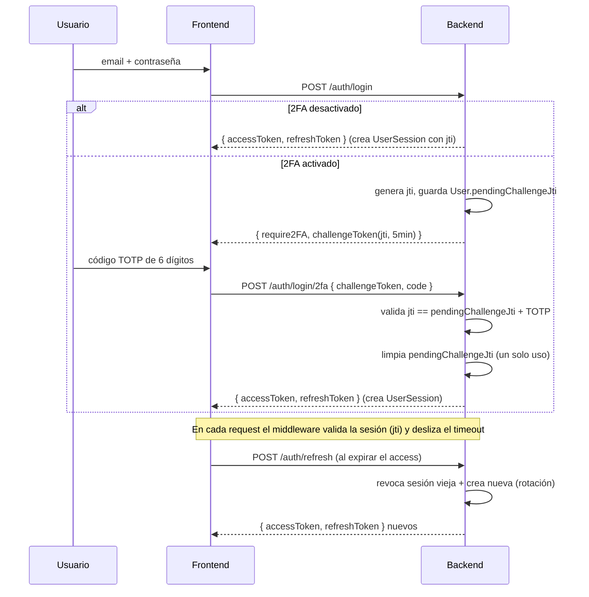

# 18 — Sprint 2: Listas de Precios, Retenciones de Venta y 2FA + Sesiones

> **Fecha:** 2026-06-20
> **Prerequisito:** Sprint 1.5 cerrado (`npx tsc --noEmit` → verde, singleton de Prisma operativo).
> **Esfuerzo total:** L (3–5 días). **Orden de ejecución:** 1) Listas de Precios → 2) Retenciones → 3) 2FA.
> **Alcance:** EXACTAMENTE estas 3 features. Sin "mejoras adicionales" salvo lo estrictamente necesario
> para que funcionen. Sin validaciones de stock/inventario (eso es Sprint 3).
>
> **✅ ESTADO: EJECUTADO (2026-06-21)** — backend + frontend de las 3 features, migración aplicada,
> `tsc --noEmit` verde en backend y frontend, y verificación end-to-end por API + render en navegador.
> Incluye las 8 mejoras de la revisión DeepSeek (ver §6). La migración también completó las tablas de
> BD pendientes del Sprint 1.5 (el EPERM había impedido migrarlas en su momento).

---

## Reglas de oro (no negociables)

1. **Toda regla de negocio nueva → `ErpConfig`.** No es un modelo Prisma: es la interfaz `ErpConfig` en
   `src/services/erp-config.service.ts`, persistida en `Company.settings` (JSON) y mezclada por sección con
   `ERP_CONFIG_DEFAULTS`. ⚠️ `mergeConfig` itera sobre `Object.keys(ERP_CONFIG_DEFAULTS)`, así que **toda sección
   o clave nueva debe añadirse primero a `ERP_CONFIG_DEFAULTS`** o no se mergeará desde lo guardado.
2. **Antes de modelar, verificar el esquema.** Varias piezas ya existen (ver §0). No duplicar.
3. **No tocar la lógica de `Invoice` ni de `Shipment`/`ShipmentItem`** salvo lo estrictamente necesario para
   integrar retenciones en la facturación.
4. **Frontend:** seguir el patrón actual — componentes funcionales, hooks con Axios, sin librerías nuevas de UI.
5. **Numeración de documentos:** si un documento nuevo necesita correlativo, usar `getNextDocumentNumber(tx, …)`
   dentro de `$transaction` (patrón del Sprint 1.5). Las listas de precios **no** necesitan correlativo.

---

## 0. Verificación previa contra `schema.prisma` (qué YA existe)

| Pieza | Estado en el código | Implicación para el Sprint 2 |
|-------|---------------------|------------------------------|
| `RetentionCatalog` (tipo RENTA/IVA, codigo, porcentaje, aplicaA) | ✅ Existe | **Reutilizar** como catálogo de tarifas de retención de venta. |
| `Customer.defaultRetentionCodeRenta` y `Customer.defaultRetentionCodeIva` | ✅ **Ya existen ambos** | **NO migrar `Customer`.** Solo poblarlos/usarlos. |
| `SriRetention` | ✅ Existe pero es de **compras** (relación a `SriDocument`) | **No reutilizar para venta.** Crear tabla nueva para venta (§2). |
| `AccountMapping` | ✅ Existe (ya trae `RETENTION_ASSET`) | En VENTA la retención es un **activo** (crédito tributario), no un pasivo → cuenta `RETENTION_ASSET`. |
| `journal.service` (asientos) | ✅ Existe | Reutilizar para el asiento de retención. |
| `User` | ❌ Sin campos 2FA | Añadir `twoFactorSecret`, `twoFactorEnabled` (§3). |
| `UserSession` | ❌ No existe | Crear (§3). |
| `PriceList` / `PriceListItem` | ❌ No existen | Crear (§1). |
| `SalesQuotation` (`quoteNumber` COT-) + sus ítems | ✅ Existen | Punto de integración de Listas de Precios (§1). |

---

## 1. Listas de Precios `[Prioridad 1 · Esfuerzo M · Riesgo bajo-medio]`

> Objetivo: que el precio de venta deje de escribirse a mano y salga de una lista vigente; el vendedor solo
> puede aplicar un descuento topado por su rol.

### 1.1 Modelos (Prisma)
```prisma
model PriceList {
  id        String          @id @default(uuid())
  companyId String
  company   Company         @relation(fields: [companyId], references: [id], onDelete: Cascade)
  name      String
  startDate DateTime        // vigencia desde
  endDate   DateTime?       // vigencia hasta (null = sin fin)
  isActive  Boolean         @default(true)
  items     PriceListItem[]
  createdAt DateTime        @default(now())
  updatedAt DateTime        @updatedAt

  @@index([companyId])
  @@index([companyId, isActive])
  @@map("price_lists")
}

model PriceListItem {
  id          String    @id @default(uuid())
  priceListId String
  priceList   PriceList @relation(fields: [priceListId], references: [id], onDelete: Cascade)
  productId   String
  product     Product   @relation(fields: [productId], references: [id])
  unitPrice   Decimal   @db.Decimal(12, 2)
  minQuantity Decimal   @default(1) @db.Decimal(12, 2) // descuento por volumen: precio aplica desde esta cantidad

  @@unique([priceListId, productId, minQuantity]) // varios escalones por producto
  @@index([priceListId])
  @@map("price_list_items")
}
```
- Añadir la relación inversa `priceLists PriceList[]` en `Company` y `priceListItems PriceListItem[]` en `Product`.
- **Vigencia:** una lista está vigente si `isActive && startDate <= now && (endDate == null || endDate >= now)`.
  Si hay más de una vigente, tomar la de `startDate` más reciente (regla determinista, documentar).

### 1.2 Servicio
- `src/services/price-list.service.ts`: CRUD de listas e ítems + `resolveUnitPrice(companyId, productId, quantity)`:
  1. Busca la lista vigente.
  2. Dentro de ella, el `PriceListItem` del producto cuyo `minQuantity` ≤ `quantity` más alto (escalón por volumen).
  3. Devuelve `{ unitPrice, source: 'PRICE_LIST', priceListId }`.
  4. **Fallback:** si no hay lista vigente o el producto no está en ella → usar el precio base del producto
     (campo de precio de venta de `Product`) y devolver `source: 'PRODUCT_BASE'`. Si tampoco hay precio base → **error**.

### 1.3 Integración en cotización/venta
- En `createQuotation` (servicio de `SalesQuotation`) y al pasar a pedido:
  - **Bloquear edición manual de `unitPrice`**: el precio se calcula con `resolveUnitPrice`, ignorando cualquier
    `unitPrice` que mande el cliente.
  - Permitir **solo** `discountPercentage` por línea, **topado por rol** vía `ErpConfig.sales.maxDiscountByRole`.
    Si el descuento excede el tope del rol del usuario (`req.user.role`) → error `DISCOUNT_EXCEEDS_ROLE_CAP`.
  - Guardar en cada ítem: `unitPrice` resuelto, `discountPercentage`, y el `priceListId` aplicado (trazabilidad).

### 1.4 `ErpConfig` (nuevas claves)
```ts
// en ErpConfig.sales
maxDiscountByRole: Record<string, number>; // ej. { ADMIN: 100, SUPERVISOR: 20, USER: 5 } (porcentaje)
// en ERP_CONFIG_DEFAULTS.sales
maxDiscountByRole: { ADMIN: 100, SALES_MANAGER: 20, USER: 5 },
```

### 1.5 Frontend
- Pantalla **Configuración → Listas de Precios**: CRUD de listas e ítems (tabla productos × precio × minQty).
- En el formulario de cotización: el campo de precio queda **read-only** (autollenado por la lista); el vendedor
  edita solo el `%` de descuento, con validación en vivo contra su tope de rol.

---

## 2. Retenciones de Venta `[Prioridad 2 · Esfuerzo M-L · Riesgo medio]`

> Objetivo: al facturar una venta, calcular automáticamente la retención que el **cliente** nos practica
> (IVA y Renta), reflejarla en el PDF y generar el asiento contable correspondiente.
> **Reutiliza** `RetentionCatalog`, `AccountMapping`, `journal.service` y los campos ya existentes de `Customer`.

### 2.1 Modelo (Prisma) — tabla nueva, NO tocar `SriRetention` (es de compras)
```prisma
model InvoiceWithholding {
  id            String   @id @default(uuid())
  invoiceId     String
  invoice       Invoice  @relation(fields: [invoiceId], references: [id], onDelete: Cascade)
  tipo          String   // RENTA | IVA
  codigo        String   // referencia a RetentionCatalog.codigo
  descripcion   String
  baseImponible Decimal  @db.Decimal(12, 2)
  porcentaje    Decimal  @db.Decimal(5, 2)
  valor         Decimal  @db.Decimal(12, 2)
  createdAt     DateTime @default(now())

  @@index([invoiceId])
  @@map("invoice_withholdings")
}
```
- Añadir relación inversa `withholdings InvoiceWithholding[]` en `Invoice` (única modificación a `Invoice`).

### 2.2 Lógica en `invoiceSalesOrder`
- Tras calcular subtotal/IVA, leer del `Customer` sus `defaultRetentionCodeRenta` / `defaultRetentionCodeIva`.
- Para cada código presente, buscar en `RetentionCatalog` (`activo`, `porcentaje`, `aplicaA`) y calcular:
  - **Renta:** base = subtotal (bienes/servicios según `aplicaA`); `valor = base * porcentaje/100`.
  - **IVA:** base = monto de IVA de la factura; `valor = ivaTotal * porcentaje/100`.
- Persistir un `InvoiceWithholding` por retención **dentro de la misma `$transaction`** que crea la factura.
- El **total a cobrar** de la factura = total − Σ retenciones (la retención es un anticipo de impuestos, no ingreso).

### 2.3 Asiento contable (reutilizar `journal.service` + `AccountMapping`)
- Junto al asiento de venta, generar el de retención:
  - **Débito:** "Retención fuente/IVA por cobrar (anticipo)" — cuenta resuelta vía `AccountMapping`.
  - **Crédito:** cuenta por cobrar del cliente (reduce el saldo cobrable en el valor retenido).
- Resolver las cuentas con `AccountMapping`; si falta el mapeo → error claro (no asientos a medias).

### 2.4 PDF
- En el servicio de PDF de factura (PDFKit), añadir un bloque "Retenciones" debajo de los totales:
  por cada `InvoiceWithholding` → tipo, código, base, %, valor; y el **Total a cobrar** neto.

### 2.5 `ErpConfig`
- Reusar la infraestructura existente; **no** se requieren claves nuevas obligatorias. (Opcional, solo si surge:
  `sales.autoWithholding: boolean` para activar/desactivar el cálculo automático — añadir a defaults si se usa.)

---

## 3. Autenticación 2FA y Sesiones `[Prioridad 3 · Esfuerzo M · Riesgo medio-alto]`

> Objetivo: segundo factor TOTP opcional por usuario + sesiones con expiración por inactividad.
> **Dependencia nueva:** `speakeasy` (+ `@types/speakeasy`) para TOTP. (Opcional: `qrcode` para el QR de enrolamiento.)

### 3.1 Modelos (Prisma)
```prisma
// añadir a User
twoFactorEnabled Boolean @default(false)
twoFactorSecret  String? // secreto TOTP base32, cifrado/oculto; null si no enrolado
sessions         UserSession[]

model UserSession {
  id             String   @id @default(uuid())
  userId         String
  user           User     @relation(fields: [userId], references: [id], onDelete: Cascade)
  token          String   @unique // jti / hash del refresh, no el JWT completo
  ip             String?
  userAgent      String?
  lastActivityAt DateTime @default(now())
  expiresAt      DateTime
  revokedAt      DateTime?
  createdAt      DateTime @default(now())

  @@index([userId])
  @@index([token])
  @@map("user_sessions")
}
```

### 3.2 Flujo de login (en `auth.service` / `auth.controller`)
1. Validar email + contraseña como hoy.
2. Si `twoFactorEnabled`: **no** emitir el JWT final aún; responder `{ require2FA: true, challengeToken }`.
3. El cliente envía el código de 6 dígitos → verificar con `speakeasy.totp.verify(secret, token)`.
4. Si OK: crear `UserSession` (con `expiresAt = now + sessionTimeoutMinutes`) y emitir el JWT.
- **Enrolamiento:** endpoint que genera `twoFactorSecret`, devuelve el `otpauth://` (QR) y exige confirmar
  un código válido antes de poner `twoFactorEnabled = true`.

### 3.3 Middleware de sesión (extiende `auth.middleware`)
- Tras verificar el JWT, validar la `UserSession` asociada: existe, `revokedAt == null`, no expirada.
- **Timeout por inactividad:** si `now - lastActivityAt > sessionTimeoutMinutes` → 401 `SESSION_EXPIRED`.
  Si está viva → actualizar `lastActivityAt` (throttle: no en cada request, p.ej. máx. 1/min para no martillar la BD).
- No romper a los usuarios sin 2FA: el middleware de sesión aplica a todos, el 2FA solo a quien lo activó.

### 3.4 `ErpConfig` (nueva sección — recordar añadirla a `ERP_CONFIG_DEFAULTS`)
```ts
security: {
  sessionTimeoutMinutes: number;      // timeout por inactividad
  require2FAForRoles?: string[];      // opcional: roles obligados a tener 2FA
};
// defaults
security: { sessionTimeoutMinutes: 30, require2FAForRoles: [] },
```

### 3.5 Frontend
- **Login en 2 pasos**: tras password, si `require2FA` → pantalla de código de 6 dígitos.
- **Perfil → Seguridad**: activar/desactivar 2FA (mostrar QR + confirmar código), ver/cerrar sesiones activas.

---

## 4. Migraciones y orden de trabajo

1. **Listas de Precios:** migración (`PriceList`, `PriceListItem` + inversas) → servicio → integración en cotización
   → `ErpConfig.sales.maxDiscountByRole` → frontend. Cierre parcial: `tsc` verde.
2. **Retenciones:** migración (`InvoiceWithholding` + inversa en `Invoice`) → cálculo en `invoiceSalesOrder`
   → asiento (`journal.service`/`AccountMapping`) → PDF → frontend. Cierre parcial: `tsc` verde.
3. **2FA/Sesiones:** `npm i speakeasy @types/speakeasy` → migración (`User` + `UserSession`) → flujo de login
   → middleware de sesión → `ErpConfig.security` → frontend. Cierre parcial: `tsc` verde.

**Definición de hecho (cada feature):** migración aplicada, `npx tsc --noEmit` verde, prueba en navegador del
flujo principal, y la regla configurable correspondiente vive en `ErpConfig` (no hardcodeada).

### Fuera de alcance (explícito)
- Validaciones de stock / inventario en cotización y facturación → **Sprint 3**.
- Notas de crédito de venta, multimoneda, y políticas de precio por cliente/segmento → backlog.
- Recuperación de 2FA por códigos de respaldo / SMS → backlog (este sprint: solo TOTP + enrolamiento por QR).

---

## 6. Mejoras DeepSeek incorporadas y decisiones de ejecución

### Backend
1. **Retención: base Bienes vs. Servicios.** `withholding.service.splitBases()` separa el subtotal por
   `Product.type` (`SERVICE` → servicios; resto → bienes) y `computeWithholdings()` elige la base según
   `RetentionCatalog.aplicaA` (`BIENES`/`SERVICIOS`/`AMBOS`). Verificado: con bienes 100 + servicios 200 y
   código RENTA `aplicaA=BIENES`, la base de renta fue **100**, no 300.
2. **JWT con `sessionId` (jti).** El access/refresh token lleva el id de la `UserSession`. El middleware valida
   ESA sesión → revocación granular (cerrar web sin tocar móvil) + auditoría. (Nota: en lugar de guardar un hash
   del jti en `token`, la sesión se identifica por su PK `id`, que es el jti — más simple y equivalente; el campo
   `token` propuesto no se usó.)
3. **Throttle de actividad 2 min.** `auth.middleware` solo actualiza `lastActivityAt`/`expiresAt` si pasaron
   > 2 min desde la última actividad. `expiresAt` actúa como deadline de inactividad deslizante.
4. **`validateConfig()`** en `erp-config.service`: valida (recursivo por sección) que la config efectiva tenga
   todas las claves de `ERP_CONFIG_DEFAULTS`; lanza `ERP_CONFIG_INVALID` si falta alguna. Se invoca en `getErpConfig`.

### Frontend
5. **Combobox de productos** en la pantalla de Listas de Precios (búsqueda por nombre/SKU, alta uno a uno).
6. **Badge de origen de precio + tope de descuento en vivo** en la cotización: el precio es read-only (de la
   lista vigente), muestra "Lista: X" o "Precio base", y el input de descuento se pone rojo + deshabilita el
   botón si supera el tope del rol (`GET /price-lists/discount-cap`).
7. **Preview de retenciones** en el detalle del pedido: sección "Retenciones aplicadas" + "Neto a cobrar"
   (`GET /sales/orders/:id/withholding-preview`).
8. **Wizard 2FA de 3 pasos** (Escanear QR → Código → Activar) en `/settings/security`; el secreto pendiente se
   guarda server-side en `User.pendingTwoFactorSecret` (sobrevive a recargas). Login en 2 pasos + lista de
   sesiones activas con revocación.

### Decisiones / hallazgos
- **Asiento de retención de venta = ACTIVO.** El plan original lo describía como "Retención por Pagar" (pasivo);
  eso es correcto para COMPRAS. En VENTA el cliente nos retiene → es crédito tributario a favor:
  **DR `RETENTION_ASSET` / CR `AR`**, y la factura nace con `paidAmount = totalRetenido` para que el saldo
  cobrable sea el neto. Corregido respecto al plan base.
- **`Product.type` en alta de producto.** El endpoint de creación no exponía `type`; se añadió
  (`PRODUCT`/`SERVICE`) porque la separación bienes/servicios de las retenciones lo requiere. Mínimo y necesario.
- **PDF de factura de venta: diferido.** No existe un generador de PDF de factura de venta en el código (las
  facturas se ven en la UI React). Crear uno desde cero excede "estrictamente necesario"; las retenciones quedan
  **expuestas en el detalle de factura** (`getInvoiceById` incluye `withholdings`) y en el preview del pedido.
  Un PDF FAC-V puede reusar el patrón de `reports.service.exportPOPdf` en un follow-up.
- **Hallazgo preexistente (no Sprint 2): `Invoice.number`/`SalesOrder.orderNumber` son `@unique` GLOBAL** pero
  las secuencias (`DocumentSequence`) son por empresa → con múltiples empresas, dos PV-0001 colisionan. No se
  tocó (fuera de alcance). Recomendación futura: unicidad compuesta `@@unique([companyId, number])`.

---

## 7. Sprint 2.1 — Endurecimiento (segunda ronda DeepSeek, 17 observaciones)

**Migración** `20260621120000_sprint21_...`: `User.pendingChallengeJti` + índices `invoice_withholdings(invoiceId,tipo)` y `(tipo,codigo)`.

| # | Mejora | Implementación |
|---|--------|----------------|
| 1 | Challenge 2FA de un solo uso | `pendingChallengeJti` en `User`; se setea al pedir 2FA y se limpia al verificar OK → no reusable. |
| 2 | Orden determinista en `resolveUnitPrice` | `orderBy: [{startDate:'desc'},{createdAt:'desc'}]`. |
| 2/16 | Rotación de refresh token | `rotateRefresh()`: revoca la sesión vieja y emite par nuevo. `client.ts` guarda el nuevo refresh + promesa compartida anti-concurrencia. |
| 3 | `validateConfig` al **guardar** | En `updateCompanySettings` antes del UPDATE → controlador devuelve 400 (`ERP_CONFIG_INVALID`). |
| 4 | Tipado seguro `findUserWithCompany` | `Prisma.UserWhereUniqueInput` (sin `as any`). |
| 5 | Traducción de errores | `getErrorMessage()` + mapa en `api/client.ts`; usado en las páginas nuevas. |
| 6 | Recuperar wizard 2FA tras recarga | `GET /auth/2fa/pending` + `SecurityPage` retoma el paso 2 con el QR. |
| 6(thr) | Throttle de actividad atómico | `updateMany` condicional (`lastActivityAt < umbral`) → sin race entre réplicas. |
| 7 | Preview de retenciones refrescable | `loadWithholding()` se reinvoca tras confirmar/despachar. |
| 8 | Combobox paginado + debounce | `GET /inventory/products/search?q=&limit=` + debounce 250 ms en PriceListsPage. |
| 9 | Pruebas automatizadas | `tests/sprint2-logic.test.ts` (7 tests: splitBases, mergeConfig, validateConfig) — `npm test` verde. |
| 12 | Índices en `InvoiceWithholding` | `@@index([invoiceId, tipo])`, `@@index([tipo, codigo])`. |
| 13 | Auditoría de precio forzado | `buildPricedItems` registra en `audit` los `unitPrice` enviados que difieren del resuelto. |
| 15 | Diagrama de flujo 2FA | Ver Mermaid abajo. |
| 17 | Caché de `ErpConfig` | `Map` con TTL 5 min + `invalidateErpConfig()` al actualizar la empresa. |

### Flujo de autenticación 2FA (DeepSeek #15)


### Pendiente para backlog (no crítico)
- **#11 separación de migraciones:** las migraciones ya aplicadas no se reescriben (riesgo en prod). Futuras
  features → una migración por feature.
- ~~**#14 editor de `ErpConfig` con Zod en el frontend**~~ → **HECHO en §8 (Sprint 2.2, 2026-07-03).**
- ~~**Cobertura de tests:** tests de integración (supertest) de los flujos~~ → **Ampliado en §8** (validación
  de settings vía supertest sin BD); e2e con BD real sigue condicionado a Docker.

---

## 8. Sprint 2.2 — Cierre del backlog #14 y huecos encontrados (2026-07-03)

Revisión del plan contra el código: las 3 features y el endurecimiento §7 estaban completos, y el
"PDF diferido" de §6 quedó cubierto por el Sprint 5 (`exportSalesInvoicePdf` ya imprime el bloque de
retenciones + Neto a cobrar). Lo que SÍ faltaba y se ejecutó:

| # | Hueco encontrado | Solución |
|---|------------------|----------|
| 1 | **`PATCH /company/settings` no aceptaba `sales` ni `security`** — el Zod del controlador las descartaba en silencio, así que los topes de descuento, el timeout de sesión y `require2FAForRoles` (las reglas nuevas del Sprint 2) eran de facto inmutables. | `company.controller.ts`: secciones `sales` (booleans + `maxDiscountByRole` record 0–100) y `security` (`sessionTimeoutMinutes` 5–1440, `require2FAForRoles` array) añadidas al schema. |
| 2 | **Defaults de `maxDiscountByRole` con roles inexistentes** — usaba `SALES_MANAGER`/`SUPERVISOR`/`USER`, pero los roles reales de la app son `GERENTE`, `GERENTE_VENTAS`, `SUPERVISOR_VENTAS`, `FUERZA_VENTAS` → la fuerza de ventas tenía tope **0%** por defecto. | Defaults ampliados con los roles reales (se conservan las claves antiguas por compat con configs guardadas). |
| 3 | **`require2FAForRoles` no se aplicaba en ningún lado** (solo existía en la interfaz). | `loginUser` devuelve `twoFactorSetupRequired: true` si el rol está obligado y el usuario no tiene 2FA; el login del front lo manda directo a `/settings/security?required2fa=1`, donde `SecurityPage` muestra el aviso sobre el wizard. Enforcement blando a propósito: bloquear en seco dejaría fuera al ADMIN que activa la regla antes de enrolarse. |
| 4 | **Backlog #14: editor de ErpConfig con Zod** — `CompanySettingsPage` no tenía UI para `sales`/`security`. | Secciones nuevas **💰 Ventas** (límite de crédito, despacho parcial, tabla de topes de descuento por rol) y **🔐 Seguridad** (timeout de sesión, checkboxes de roles obligados a 2FA), con `salesSchema`/`securitySchema` en `erpConfig.schema.ts` y errores por campo. `handleSaveErp` ahora valida TODA sección que tenga schema (también conecta el `purchasesSchema` que estaba definido pero sin usar). `ROLE_LABELS` exportado desde `lib/permissions.ts`. |
| 5 | **Tests** | `tests/integration/settings-validation.test.ts` (8 tests supertest sin BD: 400 por tope >100/negativo/no-bool, timeout fuera de rango/no entero, 403 por rol sin permiso) + 2 tests nuevos en `sprint2-logic.test.ts` (defaults con roles reales, merge de `sales`/`security` guardados). Total: **49/49 verdes**, `tsc --noEmit` verde en back y front. |

**Sigue en backlog:** #11 (migración por feature — práctica hacia adelante), e2e de flujos 2FA/retenciones
con BD real (condicionado a Docker), y la unicidad compuesta `@@unique([companyId, number])` (bug latente).
